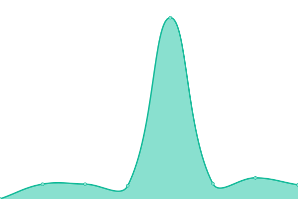
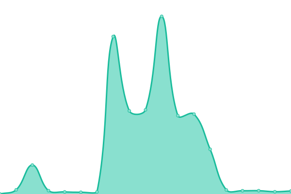
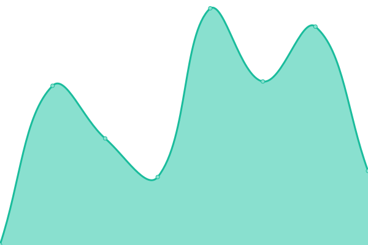

# [📈 Live Status](https://status.rekayno.ml): <!--live status--> **🟧 Partial outage**

This repository contains the open-source uptime monitor and status page for [rekayno](rekayno.ml), powered by [Upptime](https://github.com/upptime/upptime).

With [Upptime](https://upptime.js.org), you can get your own unlimited and free uptime monitor and status page, powered entirely by a GitHub repository. We use [Issues](https://github.com/rekayno/upptime/issues) as incident reports, [Actions](https://github.com/rekayno/upptime/actions) as uptime monitors, and [Pages](https://status.rekayno.ml) for the status page.

<!--start: status pages-->
<!-- This summary is generated by Upptime (https://github.com/upptime/upptime) -->
<!-- Do not edit this manually, your changes will be overwritten -->
<!-- prettier-ignore -->
| URL | Status | History | Response Time | Uptime |
| --- | ------ | ------- | ------------- | ------ |
|  [Main site](https://rekayno.ml) | 🟩 Up | [main-site.yml](https://github.com/rekayno/upptime/commits/HEAD/history/main-site.yml) | 

 324ms
     
 | 

<a href="https://status.rekayno.ml/history/main-site">100.00%</a>
    

|  [Lavalink-replit](https://lavalink-replit.rekayno.repl.co/metrics) | 🟩 Up | [lavalink-replit.yml](https://github.com/rekayno/upptime/commits/HEAD/history/lavalink-replit.yml) | 

 6379ms
     
 | 

<a href="https://status.rekayno.ml/history/lavalink-replit">97.77%</a>
    

|  [MusicBot-replit](https://discord-musicbot.rekayno.repl.co/) | 🟥 Down | [music-bot-replit.yml](https://github.com/rekayno/upptime/commits/HEAD/history/music-bot-replit.yml) | 

 206ms
     
 | 

<a href="https://status.rekayno.ml/history/music-bot-replit">0.00%</a>
    

|  [MusicBot-koyeb](https://noteblock-rekayno.koyeb.app/) | 🟩 Up | [music-bot-koyeb.yml](https://github.com/rekayno/upptime/commits/HEAD/history/music-bot-koyeb.yml) | 

 551ms
     
 | 

<a href="https://status.rekayno.ml/history/music-bot-koyeb">99.54%</a>
    

<!--end: status pages-->

[**Visit our status website →**](https://status.rekayno.ml)

## 📄 License

- Powered by: [Upptime](https://github.com/upptime/upptime)
- Code: [MIT](./LICENSE) © [rekayno](rekayno.ml)
- Data in the `./history` directory: [Open Database License](https://opendatacommons.org/licenses/odbl/1-0/)
